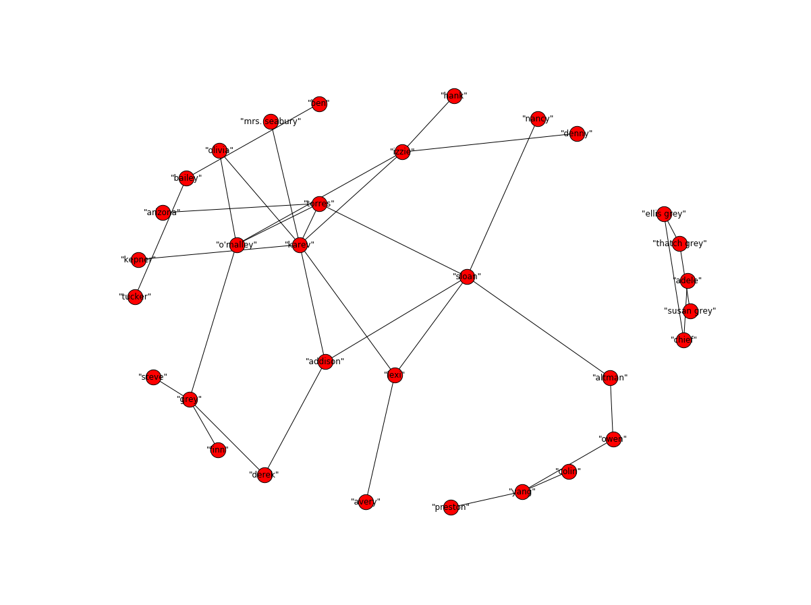
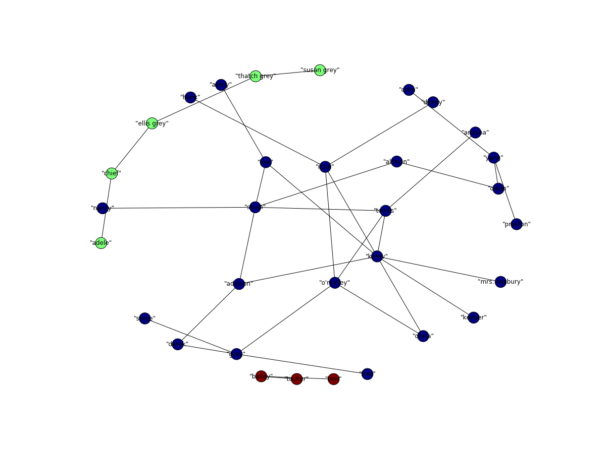
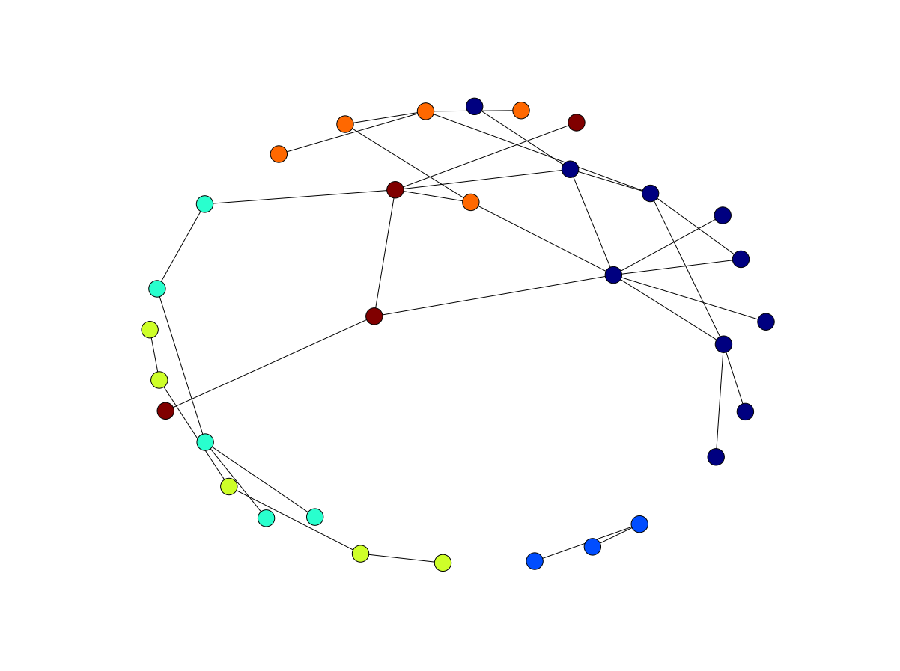
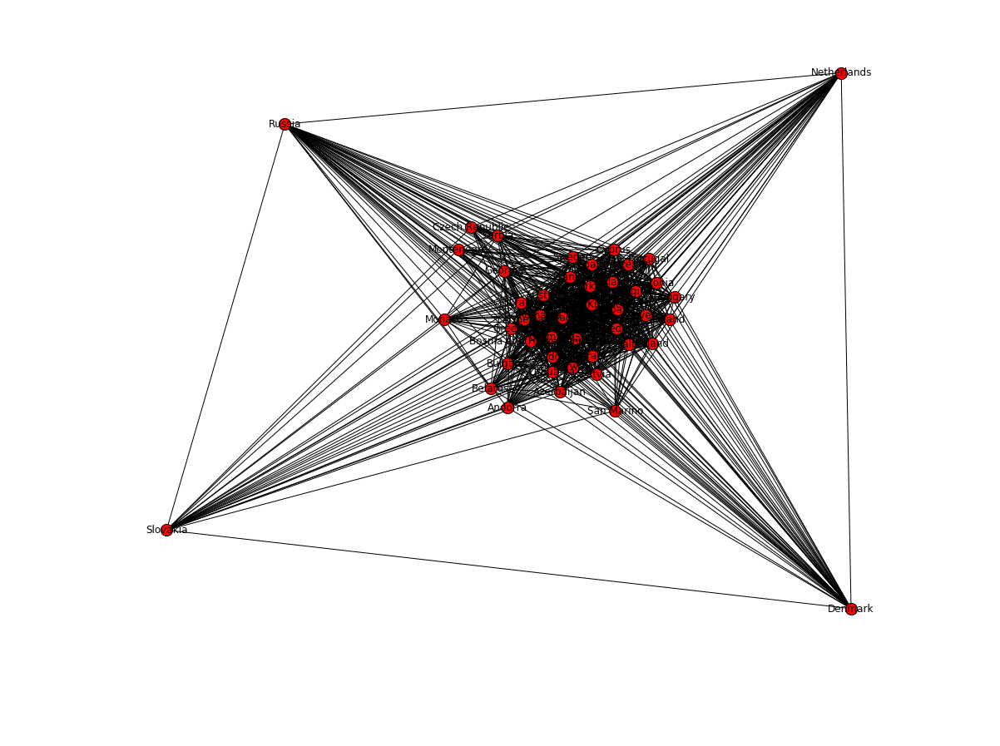
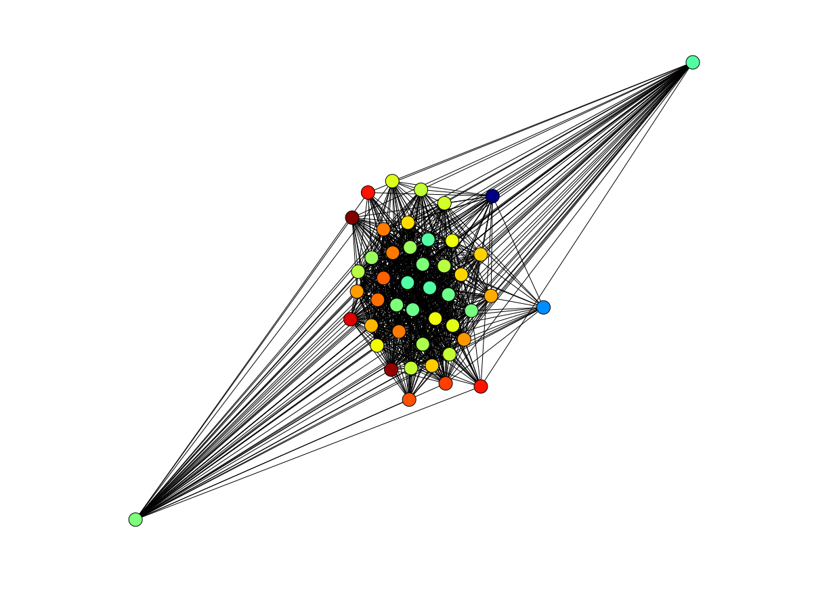
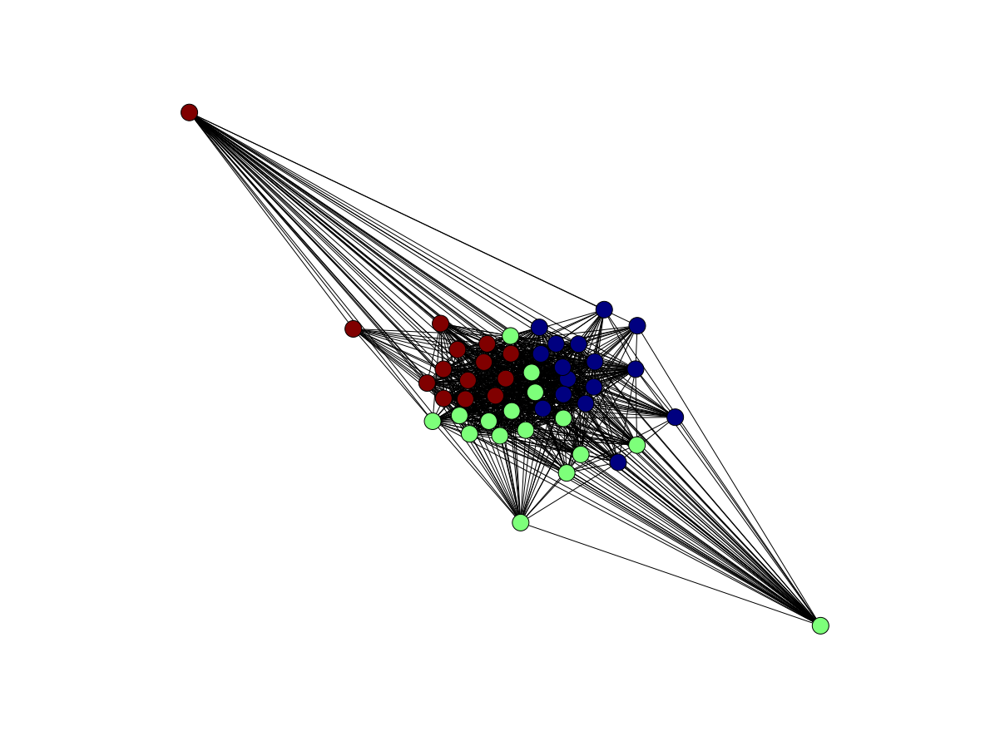

```python
%matplotlib inline

import networkx as nx
import igraph
import matplotlib.pyplot as plt
import matplotlib.pylab as pylab
import community

```


```python
actors = nx.read_edgelist("ga_actors", delimiter=',', nodetype=str)
edges = nx.read_edgelist("ga_edgelist", delimiter=',', nodetype=str)
```


#### Drawing the graph for our edgelist


```python
#nx.draw_networkx(edges, pos=None, arrows=True, with_labels=True)
nx.draw_spring(edges, cmap = plt.get_cmap('jet'), node_size=500, with_labels=True)
pylab.rcParams['figure.figsize'] = (16, 12)
plt.show()
```





#### Measuring betweenes


```python
C = nx.betweenness_centrality(edges)
C
```


    {'"addison"': 0.09480286738351254,
     '"adele"': 0.0,
     '"altman"': 0.16344086021505377,
     '"arizona"': 0.0,
     '"avery"': 0.0,
     '"bailey"': 0.002150537634408602,
     '"ben"': 0.0,
     '"chief"': 0.0064516129032258064,
     '"colin"': 0.0,
     '"denny"': 0.0,
     '"derek"': 0.038602150537634404,
     '"ellis grey"': 0.008602150537634409,
     '"finn"': 0.0,
     '"grey"': 0.10078853046594984,
     '"hank"': 0.0,
     '"izzie"': 0.10311827956989247,
     '"karev"': 0.20487455197132617,
     '"kepner"': 0.0,
     '"lexi"': 0.07741935483870968,
     '"mrs. seabury"': 0.0,
     '"nancy"': 0.0,
     '"o\'malley"': 0.11702508960573475,
     '"olivia"': 0.01064516129032258,
     '"owen"': 0.12903225806451613,
     '"preston"': 0.0,
     '"sloan"': 0.24810035842293907,
     '"steve"': 0.0,
     '"susan grey"': 0.0,
     '"thatch grey"': 0.0064516129032258064,
     '"torres"': 0.1444086021505376,
     '"tucker"': 0.0,
     '"yang"': 0.09247311827956989}


#### getting the max val


```python
maxval = max(list(C.values()))
keys = [k for k,v in C.items() if v == maxval]

print ("Maxval:" + str(maxval) + " Keys:" + str(keys))
```

    Maxval:0.24810035842293907 Keys:['"sloan"']


#### Measuring closeness


```python
C = nx.closeness_centrality(edges, u=None, distance=None, normalized=True)
C
```


    {'"addison"': 0.2892290869327502,
     '"adele"': 0.05161290322580645,
     '"altman"': 0.2337604949182501,
     '"arizona"': 0.21600653327888933,
     '"avery"': 0.19614386355209493,
     '"bailey"': 0.06451612903225806,
     '"ben"': 0.04301075268817204,
     '"chief"': 0.07373271889400922,
     '"colin"': 0.13228307076769194,
     '"denny"': 0.18752215526409075,
     '"derek"': 0.2337604949182501,
     '"ellis grey"': 0.08602150537634408,
     '"finn"': 0.17236884978820463,
     '"grey"': 0.2216170925848345,
     '"hank"': 0.18752215526409075,
     '"izzie"': 0.24731182795698925,
     '"karev"': 0.2892290869327502,
     '"kepner"': 0.21067303863002787,
     '"lexi"': 0.26253101736972706,
     '"mrs. seabury"': 0.21067303863002787,
     '"nancy"': 0.21067303863002787,
     '"o\'malley"': 0.2708653353814644,
     '"olivia"': 0.2337604949182501,
     '"owen"': 0.19173613628126135,
     '"preston"': 0.13228307076769194,
     '"sloan"': 0.2892290869327502,
     '"steve"': 0.17236884978820463,
     '"susan grey"': 0.05161290322580645,
     '"thatch grey"': 0.07373271889400922,
     '"torres"': 0.29937747594793435,
     '"tucker"': 0.04301075268817204,
     '"yang"': 0.1594814591498342}


#### getting the max val


```python
maxval = max(list(C.values()))
keys = [k for k,v in C.items() if v == maxval]

print ("Maxval:" + str(maxval) + " Keys:" + str(keys))
```

    Maxval:0.29937747594793435 Keys:['"torres"']


#### Measuring eigenvector


```python
C = nx.eigenvector_centrality_numpy(edges)
C
```


    {'"addison"': 0.2784013959452945,
     '"adele"': -7.168538463723019e-18,
     '"altman"': 0.10442628192357321,
     '"arizona"': 0.10564201543690808,
     '"avery"': 0.07734385472828534,
     '"bailey"': -1.134208435287331e-16,
     '"ben"': -1.0743081921927781e-16,
     '"chief"': -3.497939427512658e-17,
     '"colin"': 0.003524389734813515,
     '"denny"': 0.08320301854301725,
     '"derek"': 0.12570740328311858,
     '"ellis grey"': -3.821979657878594e-17,
     '"finn"': 0.044220171351811416,
     '"grey"': 0.1510783608855733,
     '"hank"': 0.08320301854301727,
     '"izzie"': 0.2842633865482769,
     '"karev"': 0.5027687871890416,
     '"kepner"': 0.1471588769531378,
     '"lexi"': 0.2642455341015449,
     '"mrs. seabury"': 0.1471588769531378,
     '"nancy"': 0.09444834886225341,
     '"o\'malley"': 0.3020119709505962,
     '"olivia"': 0.23555685153699457,
     '"owen"': 0.03408964112637741,
     '"preston"': 0.003524389734813531,
     '"sloan"': 0.322683094575425,
     '"steve"': 0.0442201713518114,
     '"susan grey"': 2.8306796300082e-17,
     '"thatch grey"': 4.962350511747676e-18,
     '"torres"': 0.36092629324926195,
     '"tucker"': -7.511989842053184e-17,
     '"yang"': 0.012041089122458978}


#### getting the max val


```python
maxval = max(list(C.values()))
keys = [k for k,v in C.items() if v == maxval]

print ("Maxval:" + str(maxval) + " Keys:" + str(keys))
```

    Maxval:0.5027687871890416 Keys:['"karev"']


#### Find a community with K-clique


```python
#K5 = nx.convert_node_labels_to_integers(edges,first_label=2)
#edges.add_edges_from(K5.edges())
c = list(nx.k_clique_communities(edges, 2))

values = []
for node in edges.nodes():
    for x in range(len(c)):
        if node in c[x]:
            values.append(x)
            
nx.draw_spring(edges, cmap = plt.get_cmap('jet'), node_color = values, node_size=500, with_labels=True)
pylab.rcParams['figure.figsize'] = (16, 12)
plt.show()
```





#### find a community using Louvain heuristices


```python
part = community.best_partition(edges)
values = [part.get(node) for node in edges.nodes()]

nx.draw_spring(edges, cmap = plt.get_cmap('jet'), node_color = values, node_size=500, with_labels=False)
pylab.rcParams['figure.figsize'] = (16, 12)
plt.show()
```





#### Check what the modularity is


```python
mod = community.modularity(part,edges)
print("modularity:", mod)
```

    modularity: 0.5947231833910034


#### And now for eurovision countries and who they voted for


```python
edges = nx.read_edgelist("euro.csv", delimiter=',', nodetype=str, edgetype=float)
```


#### Drawing the graph for our edgelist


```python
#nx.draw_networkx(edges, pos=None, arrows=True, with_labels=True)
nx.draw_spring(edges, cmap = plt.get_cmap('jet'), node_size=200, with_labels=True)
pylab.rcParams['figure.figsize'] = (16, 12)
plt.show()
```





#### Measuring betweenes


```python
C = nx.betweenness_centrality(edges)
C
```


    {'Albania': 0.0028221277732426563,
     'Andorra': 0.0004331494884854568,
     'Armenia': 0.005929256125285187,
     'Austria': 0.0069321344514185505,
     'Azerbaijan': 0.0018138193907256792,
     'Belarus': 0.003044330976319527,
     'Belgium': 0.00532453919352369,
     'Bosnia and Herzegovina': 0.007565432805027182,
     'Bulgaria': 0.0030858877701819866,
     'Croatia': 0.00332519157645565,
     'Cyprus': 0.005837466951757048,
     'Czech Republic': 0.00043478926285250386,
     'Denmark': 0.0025590788719602633,
     'Estonia': 0.002866506724399524,
     'Finland': 0.004478394598030061,
     'France': 0.005504534502628461,
     'Georgia': 0.0020076888554427623,
     'Germany': 0.006961889619108518,
     'Greece': 0.007565432805027182,
     'Hungary': 0.0021948311373598726,
     'Iceland': 0.0023746731343164385,
     'Ireland': 0.0034529004039475833,
     'Israel': 0.0025590788719602633,
     'Latvia': 0.0025590788719602633,
     'Lithuania': 0.00401040503552525,
     'Macedonia': 0.005853495269866161,
     'Malta': 0.004850539463570046,
     'Moldova': 0.004736171964762168,
     'Monaco': 0.0014596396175152017,
     'Montenegro': 0.00043478926285250386,
     'Netherlands': 0.0063241940161266625,
     'Norway': 0.003829614936663639,
     'Poland': 0.0007664773560649153,
     'Portugal': 0.001459216243956227,
     'Romania': 0.006961889619108518,
     'Russia': 0.007565432805027182,
     'San Marino': 0.001041429034025404,
     'Serbia': 0.0009331143165135263,
     'Slovakia': 0.00540841428530011,
     'Slovenia': 0.00413834884600972,
     'Spain': 0.006677710423286681,
     'Sweden': 0.006067673648143087,
     'Switzerland': 0.005837466951757048,
     'Turkey': 0.006677710423286681,
     'Ukraine': 0.007565432805027182,
     'United Kingdom': 0.006677710423286681}


#### getting the max val


```python
maxval = max(list(C.values()))
keys = [k for k,v in C.items() if v == maxval]

print ("Maxval:" + str(maxval) + " Keys:" + str(keys))
```

    Maxval:0.007565432805027182 Keys:['Greece', 'Bosnia and Herzegovina', 'Russia', 'Ukraine']


#### Measuring closeness


```python
C = nx.closeness_centrality(edges, u=None, distance=None, normalized=True)
C
```


    {'Albania': 0.8653846153846154,
     'Andorra': 0.703125,
     'Armenia': 0.9375,
     'Austria': 0.9183673469387755,
     'Azerbaijan': 0.75,
     'Belarus': 0.75,
     'Belgium': 0.9,
     'Bosnia and Herzegovina': 0.9782608695652174,
     'Bulgaria': 0.7627118644067796,
     'Croatia': 0.9,
     'Cyprus': 0.9,
     'Czech Republic': 0.6338028169014085,
     'Denmark': 0.8823529411764706,
     'Estonia': 0.8490566037735849,
     'Finland': 0.9,
     'France': 0.9183673469387755,
     'Georgia': 0.75,
     'Germany': 0.9574468085106383,
     'Greece': 0.9782608695652174,
     'Hungary': 0.8181818181818182,
     'Iceland': 0.8653846153846154,
     'Ireland': 0.8823529411764706,
     'Israel': 0.8823529411764706,
     'Latvia': 0.8823529411764706,
     'Lithuania': 0.8823529411764706,
     'Macedonia': 0.9375,
     'Malta': 0.9183673469387755,
     'Moldova': 0.9183673469387755,
     'Monaco': 0.6818181818181818,
     'Montenegro': 0.6338028169014085,
     'Netherlands': 0.9183673469387755,
     'Norway': 0.9183673469387755,
     'Poland': 0.8333333333333334,
     'Portugal': 0.8333333333333334,
     'Romania': 0.9574468085106383,
     'Russia': 0.9782608695652174,
     'San Marino': 0.6081081081081081,
     'Serbia': 0.6818181818181818,
     'Slovakia': 0.703125,
     'Slovenia': 0.8823529411764706,
     'Spain': 0.9574468085106383,
     'Sweden': 0.9375,
     'Switzerland': 0.9,
     'Turkey': 0.9574468085106383,
     'Ukraine': 0.9782608695652174,
     'United Kingdom': 0.9574468085106383}


#### getting the max val


```python
maxval = max(list(C.values()))
keys = [k for k,v in C.items() if v == maxval]

print ("Maxval:" + str(maxval) + " Keys:" + str(keys))
```

    Maxval:0.9782608695652174 Keys:['Greece', 'Bosnia and Herzegovina', 'Russia', 'Ukraine']


#### Measuring eigenvector


```python
C = nx.eigenvector_centrality_numpy(edges)
C
```


    {'Albania': 0.1521651947809244,
     'Andorra': 0.1056730614615738,
     'Armenia': 0.1632456544169775,
     'Austria': 0.15824217469345955,
     'Azerbaijan': 0.12045636152981719,
     'Belarus': 0.1187600039096399,
     'Belgium': 0.1572229046866906,
     'Bosnia and Herzegovina': 0.16867921716435838,
     'Bulgaria': 0.12322495531704614,
     'Croatia': 0.15923825283219892,
     'Cyprus': 0.15658373807129441,
     'Czech Republic': 0.0775009511332236,
     'Denmark': 0.15677933971788188,
     'Estonia': 0.14938367493200996,
     'Finland': 0.1577755274518844,
     'France': 0.1601293938097934,
     'Georgia': 0.12014664830761063,
     'Germany': 0.16560743918351256,
     'Greece': 0.16867921716435835,
     'Hungary': 0.14224144358376375,
     'Iceland': 0.153063963414489,
     'Ireland': 0.15196235670981886,
     'Israel': 0.1567793397178819,
     'Latvia': 0.15677933971788188,
     'Lithuania': 0.15468002373471273,
     'Macedonia': 0.16386322516668891,
     'Malta': 0.1613519110174076,
     'Moldova': 0.16139639364374586,
     'Monaco': 0.09206692515874362,
     'Montenegro': 0.07750095113322365,
     'Netherlands': 0.15973421883597202,
     'Norway': 0.1622049840566367,
     'Poland': 0.14856422901855473,
     'Portugal': 0.1472779351554274,
     'Romania': 0.1656074391835126,
     'Russia': 0.16867921716435835,
     'San Marino': 0.06044047670827632,
     'Serbia': 0.09822519067623268,
     'Slovakia': 0.09380677696307112,
     'Slovenia': 0.15497468547076318,
     'Spain': 0.1662808681801111,
     'Sweden': 0.1632011717906392,
     'Switzerland': 0.15658373807129453,
     'Turkey': 0.1662808681801111,
     'Ukraine': 0.16867921716435832,
     'United Kingdom': 0.16628086818011106}


#### getting the max val


```python
maxval = max(list(C.values()))
keys = [k for k,v in C.items() if v == maxval]

print ("Maxval:" + str(maxval) + " Keys:" + str(keys))
```

    Maxval:0.16867921716435838 Keys:['Bosnia and Herzegovina']


#### Find a community with Network Clustering


```python
part = nx.clustering(edges)
values = [part.get(node) for node in edges.nodes()]

nx.draw_spring(edges, cmap = plt.get_cmap('jet'), node_color = values, node_size=400, with_labels=False)
pylab.rcParams['figure.figsize'] = (16, 12)
plt.show()
```





#### Check what the modularity is


```python
mod = community.modularity(part,edges)
print("modularity:", mod)
```

    modularity: 0.06164935872284698


#### find a community using Louvain heuristices


```python
part = community.best_partition(edges)
values = [part.get(node) for node in edges.nodes()]

nx.draw_spring(edges, cmap = plt.get_cmap('jet'), node_color = values, node_size=400, with_labels=False)
pylab.rcParams['figure.figsize'] = (16, 12)
plt.show()
```





#### Check what the modularity is


```python
mod = community.modularity(part,edges)
print("modularity:", mod)
```

    modularity: 0.06164935872284698


```python

```
